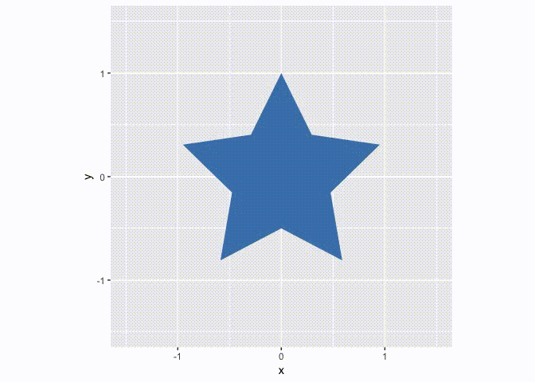
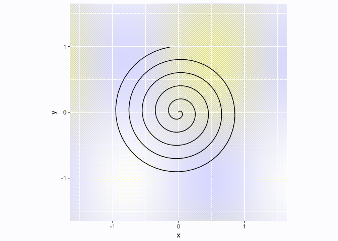
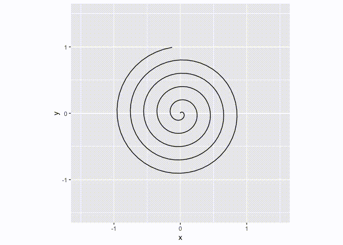
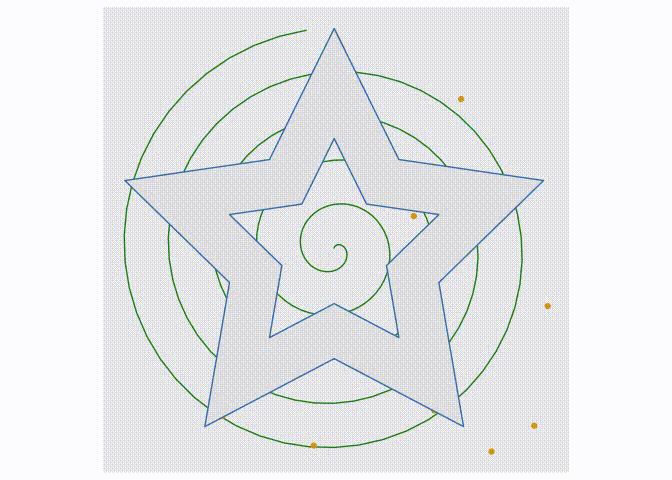

<!-- README.md is generated from README.Rmd. Please edit that file -->

# transformr 

[](https://travis-ci.org/thomasp85/transformr)
[](https://ci.appveyor.com/project/thomasp85/transformr)
[](https://cran.r-project.org/package=transformr)
[](https://cran.r-project.org/package=transformr)
[](https://codecov.io/github/thomasp85/transformr?branch=master)

If you’ve ever made animated data visualisations you’ll know that
arbitrary polygons and lines requires special considerations if the
animation is to be smooth and believable. `transformr` is able to remove
all of these worries by expanding
[`tweenr`](https://github.com/thomasp85/tweenr) to understand spatial
data, and thus lets you focus on defining your animation steps.
`transformr` takes care of matching shapes between states, cutting some
in bits if the number doesn’t match between the states, and ensures that
each pair of matched shapes contains the same number of anchor points
and that these are paired up so as to avoid rotation and inversion
during animation.

`transformr` supports both polygons (with holes), and paths either
encoded as simple x/y data.frames or as simpel features using the
[`sf`](https://github.com/r-spatial/sf) package.

## Installation

You can install transformr from github with:

``` r
# install.packages("devtools")
devtools::install_github("thomasp85/transformr")
```

## Examples

These are simple, contrieved examples showing how the API works. It
scales simply to more complicated shapes.

### Polygon

A polygon is simply a data.frame with an `x` and `y` column, where each
row demarcates an anchor point for the polygon. The polygon is not in
closed form, that is, the first point is not repeated in the end. If
more polygons are wanted you can provide an additional column that
indicate the polygon membership of a column (quite like
`ggplot2::geom_polygon()` expects an `x`, `y`, and `group` variable). If
holed polygons are needed, holes should follow the main polygon and be
separated with an `NA` row in the `x` and `y` column.

``` r
library(transformr)
library(tweenr)
library(ggplot2)
polyplot <- function(data) {
  p <- ggplot(data) + 
    geom_polygon(aes(x, y, group = id, fill = col)) +
    scale_fill_identity() +
    coord_fixed(xlim = c(-1.5, 1.5), ylim = c(-1.5, 1.5))
  plot(p)
}

star <- poly_star()
star$col <- 'steelblue'
circles <- poly_circles()
circles$col <- c('forestgreen', 'firebrick', 'goldenrod')[circles$id]

animation <- tween_polygon(star, circles, 'cubic-in-out', 40, id) %>% 
  keep_state(10)

ani <- lapply(split(animation, animation$.frame), polyplot)
```



By default the polygons are matched up based on their id. In the above
example there’s a lack of polygons in the start-state, so these have to
appear somehow. This is governed by the `enter` function, which by
default is `NULL` meaning new polygons just appear at the end of the
animation. We can change this to get a nicer result:

``` r
# Make new polygons appear 2 units below their end position
from_below <- function(data) {
  data$y <- data$y - 2
  data
}
animation <- tween_polygon(star, circles, 'cubic-in-out', 40, id, enter = from_below) %>% 
  keep_state(10)

ani <- lapply(split(animation, animation$.frame), polyplot)
```


Similar to the `enter` function it is possible to supply an `exit`
function when the start state has more polygons than the end state.
These functions get a single polygon with the state it was/will be, that
can then be manipulated at will, as long as the same number of rows and
columns are returned.

> The `enter` and `exit` functions have slightly different semantics
> here than in `tweenr::tween_state()` where it gets all
> entering/exiting rows in one go, and not one-by-one

Our last option is to not match the polygons up, but simply say “make
everything in the first state, into everything in the last state…
somehow”. This involves cutting up polygons in the state with fewest
polygons and match polygons by minimizing the distance and area
difference between pairs. All of this is controlled by setting `match =
FALSE` in `tween_polygon()`, and `transformr` will then do its magic:

``` r
animation <- tween_polygon(star, circles, 'cubic-in-out', 40, id, match = FALSE) %>% 
  keep_state(10)

ani <- lapply(split(animation, animation$.frame), polyplot)
```


### Paths

Paths are a lot like polygons, except that they don’t *wrap-around*.
Still, slight differences in how they are tweened exists. Chief among
these are that the winding order are not changed to minimize the
travel-distance, because paths often have an implicit direction and this
should not be tampered with. Further, when automatic matching paths
(that is, `match = FALSE`), paths are matched to minimize the difference
in length as well as the pair distance. The same interpretation of the
`enter`, `exit`, and `match` arguments remain, which can be seen in the
two examples below:

``` r
pathplot <- function(data) {
  p <- ggplot(data) + 
    geom_path(aes(x, y, group = id)) +
    coord_fixed(xlim = c(-1.5, 1.5), ylim = c(-1.5, 1.5))
  plot(p)
}
spiral <- path_spiral()
waves <- path_waves()

animation <- tween_path(spiral, waves, 'cubic-in-out', 40, id, enter = from_below) %>% 
  keep_state(10)

ani <- lapply(split(animation, animation$.frame), pathplot)
```



``` r
animation <- tween_path(spiral, waves, 'cubic-in-out', 40, id, match = FALSE) %>% 
  keep_state(10)

ani <- lapply(split(animation, animation$.frame), pathplot)
```



### Simple features

The `sf` package provides an implemention of simple features which are a
way to encode any type of geometry in defined classes and operate on
them. `transformr` supports (multi)point, (multi)linestring, and
(multi)polygon geometries which acount for most of the use cases. When
using the `tween_sf()` function any `sfc` column will be tweened by
itself, while the rest will be tweened by `tweenr::tween_state()`. For
any *multi* type, the tweening progress as if `match = FALSE` in
`tween_polygon()` and `tween_path()`, that is polygons/paths are cut and
matched to even out the two states. For multipoint the most central
points are replicated to ensure the same number of points in each state.
One nice thing about `sf` is that you can encode different geometry
types in the same data.frame and plot it all at once:

``` r
sfplot <- function(data) {
  p <- ggplot(data) + 
    geom_sf(aes(colour = col, geometry = geometry)) + 
    coord_sf(datum = NA) + # remove graticule
    scale_colour_identity()
  plot(p)
}
star_hole <- poly_star_hole(st = TRUE)
circles <- poly_circles(st = TRUE)
spiral <- path_spiral(st = TRUE)
waves <- path_waves(st = TRUE)
random <- point_random(st = TRUE)
grid <- point_grid(st = TRUE)
df1 <- data.frame(
  geo = sf::st_sfc(star_hole, spiral, random),
  col = c('steelblue', 'forestgreen', 'goldenrod')
)
df2 <- data.frame(
  geo = sf::st_sfc(circles, waves, grid),
  col = c('goldenrod', 'firebrick', 'steelblue')
)

animation <- tween_sf(df1, df2, 'cubic-in-out', 40) %>% 
  keep_state(10)

ani <- lapply(split(animation, animation$.frame), sfplot)
```



## Future

The main goal right now is to get `transformr` ready for a release on
CRAN. Further development will be guided by the needs of the community,
so open an issue if you have any unmet needs or cool ideas\!
